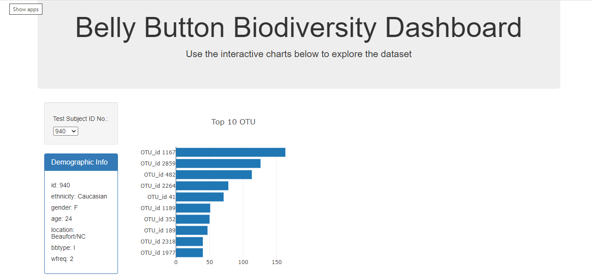

# Plot.ly Project 

## Belly Button Biodiversity

This project represents an interactive dashboard to explore the [Belly Button Biodiversity dataset](http://robdunnlab.com/projects/belly-button-biodiversity/), which catalogs the microbes that colonize human navels.

The dataset reveals that a small handful of microbial species (also called operational taxonomic units, or OTUs, in the study) were present in more than 70% of people, while the rest were relatively rare.

##  Plotly

1. D3 library was used to read in `samples.json`.

2. A horizontal bar chart with a dropdown menu is created to display the top 10 OTUs found in that individual.

*  `sample_values` as the values for the bar chart.

*  `otu_ids` as the labels for the bar chart.

*  `otu_labels` as the hovertext for the chart.

  

3. A bubble chart is created to display each sample.

*  `otu_ids` for the x values.

*  `sample_values` for the y values.

*  `sample_values` for the marker size.

*  `otu_ids` for the marker colors.

*  `otu_labels` for the text values.

4. The sample metadata is displayed right under your selection for an ID in a small table format, i.e., an individual's demographic information.

5. All of the plots are updated any time when a new sample is selected.

### The final dashboard is shown below:

## Deployment

* The app is deployed to a free static page hosting service, such as GitHub Pages. 

## References

Hulcr, J. et al.(2012) _A Jungle in There: Bacteria in Belly Buttons are Highly Diverse, but Predictable_. Retrieved from: [http://robdunnlab.com/projects/belly-button-biodiversity/results-and-data/](http://robdunnlab.com/projects/belly-button-biodiversity/results-and-data/)

- - -

